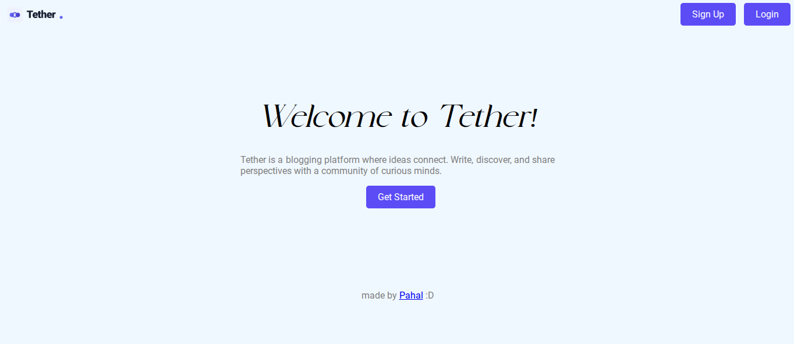
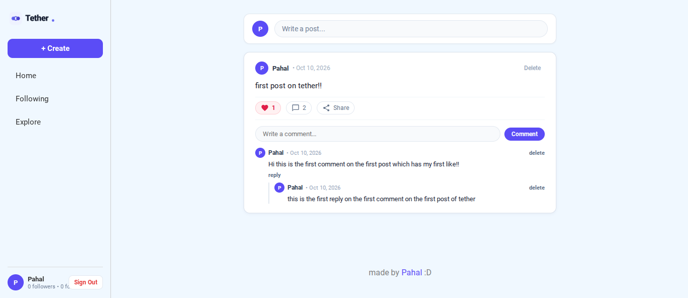

# Tether

## What is it?
It's a platform where people write and share stories and experiences on vaarious topics
the site is live and deployed using github pages. you can use it [here](https://pahal-desai.github.io/tether/).
## Tech stack
It's a full stack web app made using vanilla html, css and js.
I used Supabase to store posts, likes, comments, users, etc.
I used Cloudflare worker to store all the server side logic and API endpoints.

## Features
* user authentication using firebase
* user authentication using github
* user can create, read, delete posts
* like and comment on posts
* replies on comments

## What did i learn?
I learnt a lot about backend, databases and how cloudflare workers work.

## Screenshots

* landing page

* home page

